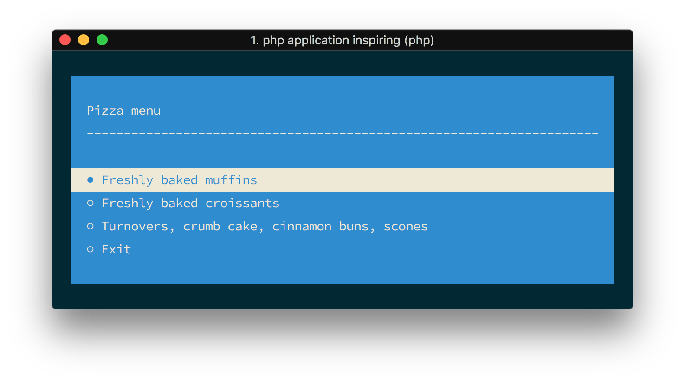
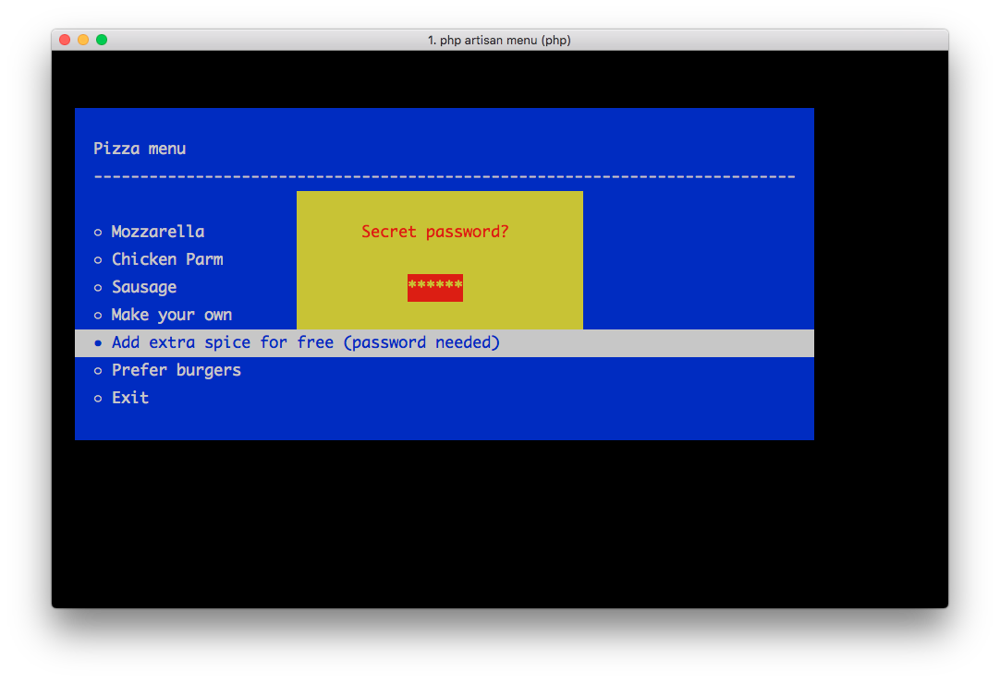

<p align="center">
    
</p>

<p align="center">
  <a href="https://github.com/nunomaduro/laravel-console-menu/actions/workflows/static.yml"></img></a>
  <a href="https://packagist.org/packages/nunomaduro/laravel-console-menu"></a>
  <a href="https://packagist.org/packages/nunomaduro/laravel-console-menu"></a>
</p>

## About Laravel Console Menu

Laravel Console Menu was created by, and is maintained by [Nuno Maduro](https://github.com/nunomaduro), and is a [php-school/cli-menu](https://github.com/php-school/cli-menu) wrapper for Laravel Console Commands.

## Installation

> **Requires [PHP 8.1+](https://php.net/releases)**

Require Laravel Console Menu using [Composer](https://getcomposer.org):

```bash
composer require nunomaduro/laravel-console-menu
```

## Usage

### Quick Setup

```php
class MenuCommand extends Command
{
    /**
     * Execute the console command.
     *
     * @return void
     */
    public function handle()
    {
        $option = $this->menu('Pizza menu', [
            'Freshly baked muffins',
            'Freshly baked croissants',
            'Turnovers, crumb cake, cinnamon buns, scones',
        ])->open();

        $this->info("You have chosen the option number #$option");
    }
}
```

### Setup with a question

<p align="center">
    
</p>

```php
class MenuCommand extends Command
{
    /**
     * Execute the console command.
     *
     * @return void
     */
    public function handle()
    {
        $option = $this->menu('Pizza menu')
                    ->addOption('mozzarella', 'Mozzarella')
                    ->addOption('chicken_parm', 'Chicken Parm')
                    ->addOption('sausage', 'Sausage')
                    ->addQuestion('Make your own', 'Describe your pizza...')
                    ->addOption('burger', 'Prefer burgers')
                    ->setWidth(80)
                    ->open();
        
        $this->info("You have chosen the text option: $option");
    }
}
```

### Setup with advanced option, in this case, a password

<p align="center">
    
</p>

```php
class MenuCommand extends Command
{
    /**
     * Execute the console command.
     *
     * @return void
     */
    public function handle()
    {
        $menu = $this->menu('Pizza menu')
                    ->addOption('mozzarella', 'Mozzarella')
                    ->addOption('chicken_parm', 'Chicken Parm')
                    ->addOption('sausage', 'Sausage')
                    ->addQuestion('Make your own', 'Describe your pizza...');
        
        $itemCallable = function (CliMenu $cliMenu) use ($menu) {
            $cliMenu->askPassword()
                ->setValidator(function ($password) {
                    return $password === 'secret';
                })
                ->setPromptText('Secret password?')
                ->ask();

            $menu->setResult('Free spice!');

            $cliMenu->close();
        };
        $menu->addItem('Add extra spice for free (password needed)', $itemCallable);


        $option = $menu->addOption('burger', 'Prefer burgers')
            ->setWidth(80)
            ->open();

        $this->info("You have chosen the text option: $option");
    }
}
```


### Appearance

Available colors: `black`, `red`, `green`, `yellow`, `blue`, `magenta`, `cyan`, `white`.

```php
  $this->menu($title, $options)
      ->setForegroundColour('green')
      ->setBackgroundColour('black')
      ->setWidth(200)
      ->setPadding(10)
      ->setMargin(5)
      ->setExitButtonText("Abort") // remove exit button with ->disableDefaultItems()
      ->setTitleSeparator('*-')
      ->addLineBreak('<3', 2)
      ->addStaticItem('AREA 2')
      ->open();
```

Check out the full documentation [here](https://github.com/php-school/cli-menu/blob/master/README.md).

## Contributing

Thank you for considering to contribute to Laravel Console Menu. All the contribution guidelines are mentioned [here](CONTRIBUTING.md).

You can have a look at the [CHANGELOG](CHANGELOG.md) for constant updates & detailed information about the changes. You can also follow the twitter account for latest announcements or just come say hi!: [@enunomaduro](https://twitter.com/enunomaduro)

## Support the development
**Do you like this project? Support it by donating**

- PayPal: [Donate](https://www.paypal.com/cgi-bin/webscr?cmd=_s-xclick&hosted_button_id=66BYDWAT92N6L)
- Patreon: [Donate](https://www.patreon.com/nunomaduro)

## License

Laravel Console Menu is an open-sourced software licensed under the [MIT license](LICENSE.md).
